# CDE API with Postman


Cloudera Data Engineering (CDE) provides first-class APIs for programmatic access and automation workflows – whether it’s integration with 3rd party tools or inclusion in your own applications.

This tutorial will teach how to use the REST APIs to: 

* Bootstrap your CDE service with sample jobs
* Learn the API through examples
* Run sanity tests of your service


## Demo setup


In order to complete this tutorial, you will need a free Postman instance (we recommend the SaaS version). 

Once you have created an account, please clone the following github repository to your local desktop. 
You will need a file stored here in one of the exercises. 

You can clone a github repository by entering the following command from your terminal:

```
git clone https://github.com/pdefusco/Postman2CDE
```

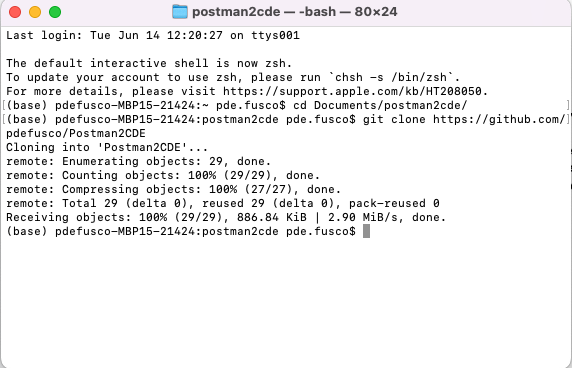


## Section 1: Getting started with a simple request to CDE 


Identify a CDE VC you want to work with. Navigate to the VC Cluster Details page and copy the JOBS API URL to the clipboard as shown below

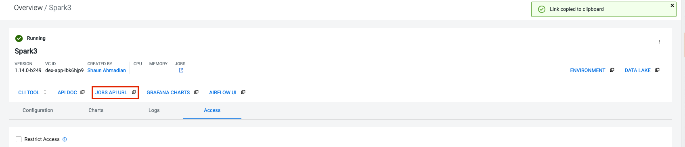

Obtain the API Token: open your local computer’s terminal and enter the following command

```
curl -u <workload_user> $(echo '<grafana_charts>' | cut -d'/' -f1-3 | awk '{print $1"/gateway/authtkn/knoxtoken/api/v1/token"}') | jq -r '.access_token'
```

* The workload_user is your CDP Username. If you are not sure what it is please reach out to your CDP Administrator.
* You can copy the value for the 'grafana_charts' variable to your clipboard from the Virtual Cluster’s Cluster Details page as shown below.
* Notice the token expires after 60 minutes. If you get an error message when running any of the below commands, refreshing it might solve the problem.

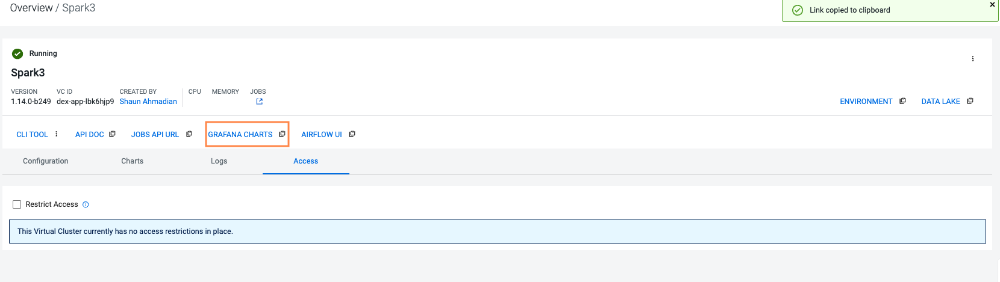

Navigate to the Postman website, create an account, and then enter a workspace. 

Create a new collection, call it “CDE API”

Click on the horizontal three dots next to the collection name, select “edit” and add a new variable

* Variable Name: “CDE_JOB_URL”
* Initial Value: paste the first variable you copied in part 1
* Hit Save to ensure that the variable is available to other parts of the collection

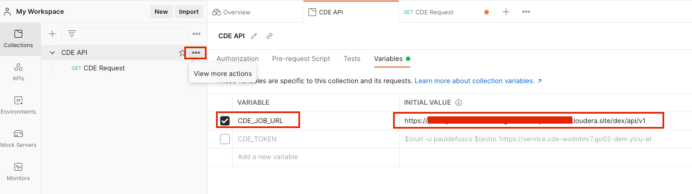

In this step we will create a new request within the Postman collection

* Click again on the horizontal three dots next to the Collection name; select “Add Request” and call it “CDE Request”
* Select the “GET” option from the dropdown, then enter the CDE JOB URL variable followed by the resources endpoint as shown below
* Click send and observe the request fail. We haven’t yet accounted for the authorization mechanism, we’ll do so in the next step. 

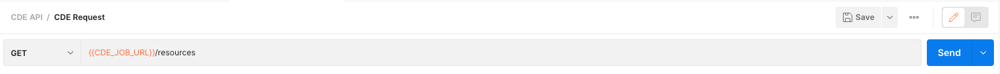

Now set the authorization mechanism to send the request to your CDE Cluster.

* On the same page, open the “Authorization” tab and then select “Bearer Token” in the “Type” drop down. 
* Enter the token you obtained in step 2 into the “Token” field

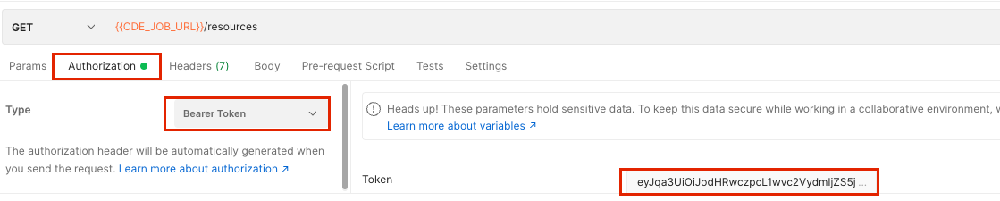

You are now ready to send your first request to your CDE Cluster. 
Hit the “Send” button again and observe the response in the lower half of your screen.

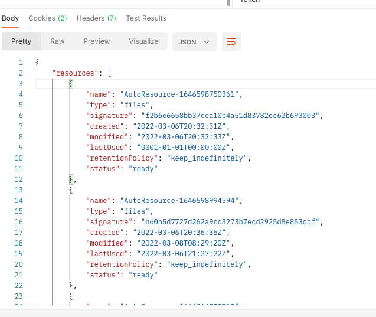


## Section 2: Adding more requests to your collection


We recommend visiting the API Docs page of your CDE Virtual Cluster to learn more about the API’s methods. 

You can reach the Docs by going to the Cluster Details page and clicking on the API DOC icon.

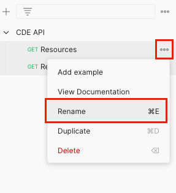

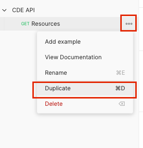

Rename your prior request to “Resources” by clicking on the three horizontal dots and selecting the “Rename” option

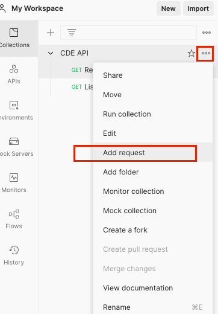

Then, create a new request by clicking on the three horizontal dots again and selecting “Add request”

* Name the request “List Jobs”
* Set the Bearer Token as you did previously
* Modify the request to {{CDE_JOB_URL}}/job-runs

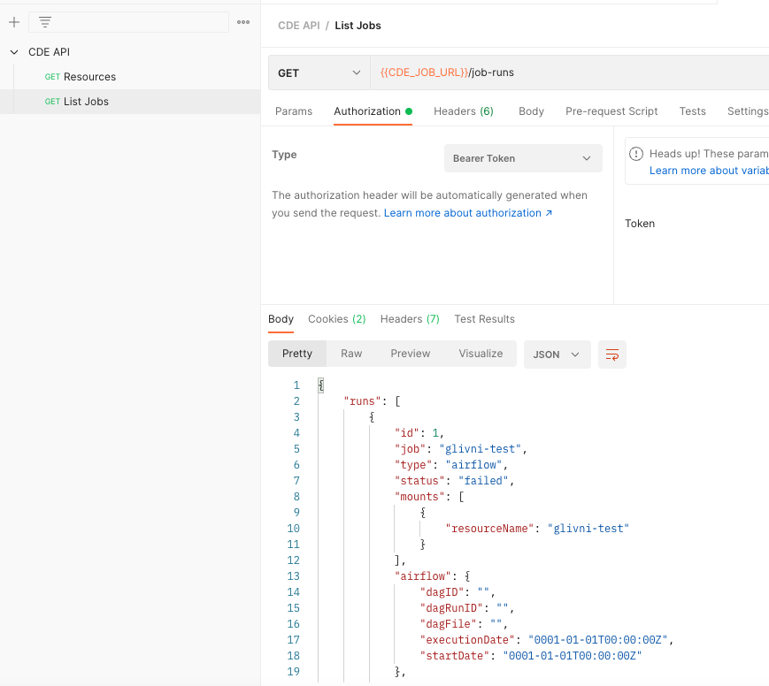

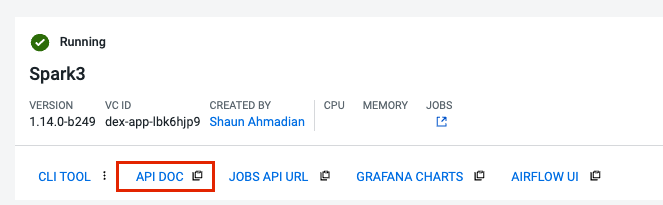

Set the Authorization Token parameter with the token you obtained earlier. Notice the token value will be automatically populated for you.
Now configure your request to list all job runs by replacing the “resources” term with “job-runs”. Then submit.

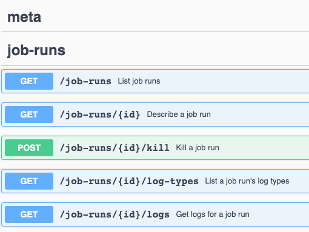


Let’s create more requests. Next, we will create a request to create a CDE resource

* Create a request with the name “Create Resource”. 
* Select the “POST” option from the dropdown
* Enter “{{CDE_JOB_URL}}/resources” in the request field
* Open the “Body” tab, then the “Raw” option and enter the following json:
      {"name": "cde_REPORTS_postman"}
* Make sure you select the “JSON” option next to the GraphQL tab

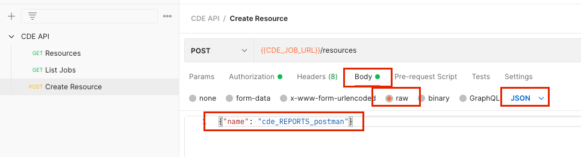

Navigate to the CDE Virtual Cluster, open the resources tab and validate that your resource has now been created:

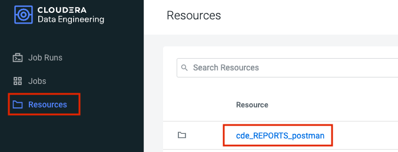


Next, a request by the name of “Upload File” to load the Python file in the CDE Resource we just created 

* Set the request to “PUT” and in the “Body” tab select the “pi.py” file that is saved on your local desktop in the project folder you cloned from this guide’s GitHub repository.

```
{{CDE_JOB_URL}}/resources/cde_REPORTS_postman/pi.py
```

* In the “Body” tab, make sure to select the “file” option (vs. “text”) and also ensure to actually rename the key to “file”.
* Then, in the “Value” field, select the file location on your local desktop.  

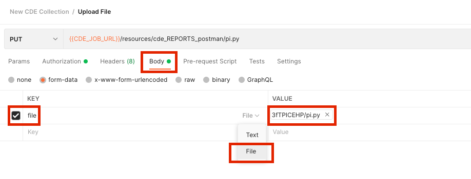


Then, a “Verify Upload” request:

* Set the request to “GET” and use the following request value: 

```
{{CDE_JOB_URL}}/resources/cde_REPORTS_postman
```

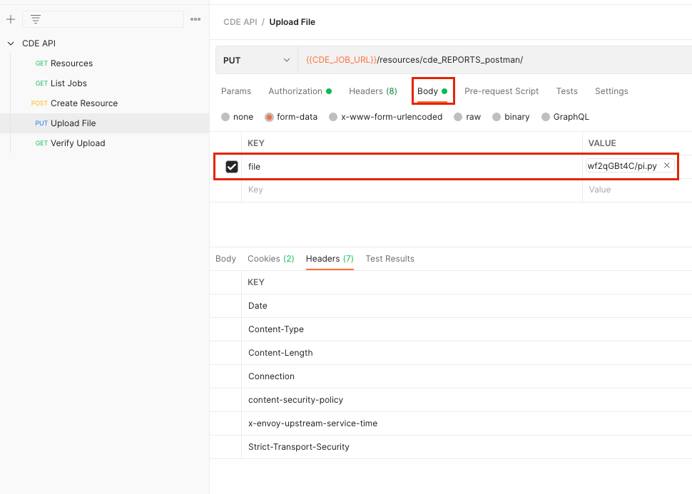


Next, a “Create Spark Job” request

* Set the request to “POST” and the request field to:

```
{{CDE_JOB_URL}}/jobs
```

* In the “Body” field, enter the below json sample and ensure you select the “JSON” option
* Make sure you edit the sample json with your username and relevant dates

```
{ "name": "pi_job",
 "type": "spark",
 "retentionPolicy": "keep_indefinitely",
 "mounts": [{"dirPrefix": "/","resourceName":"cde_REPORTS_postman"}],
 "spark": { "file": "pi.py", "conf": {"spark.pyspark.python":"python3"}},
 "schedule":
   { "enabled": true,
     "user": "pauldefusco",
     "cronExpression": "30 */1 * * *",
     "start": "2022-04-12",
     "end": "2022-08-18" }
 }
```

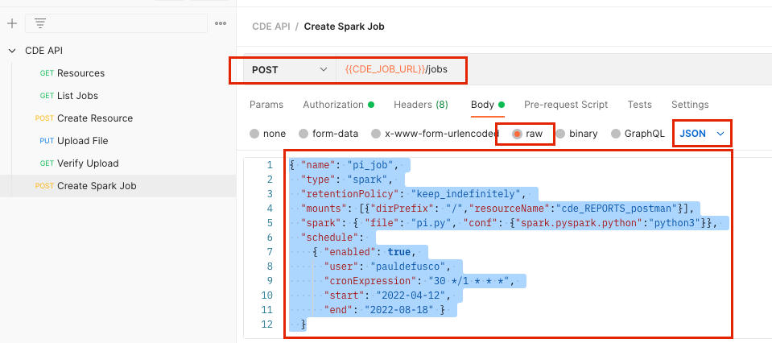

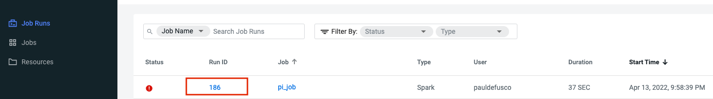

Finally, a job by the name of “Get Spark Driver Logs”

* Set the request type to “GET” and the request field to:

```
{{CDE_JOB_URL}}/job-runs/186/logs?type=driver%2Fstdout
```

* Open the “Params” tab and enter the following:

```
Key: “type”
Value: “driver%2Fstdout”
Hit submit and observe the Spark Driver Logs output in the response body
```

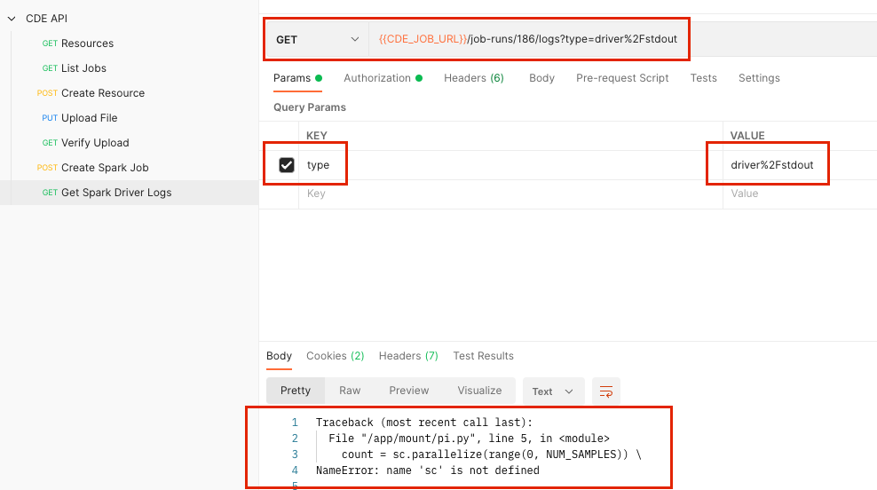

